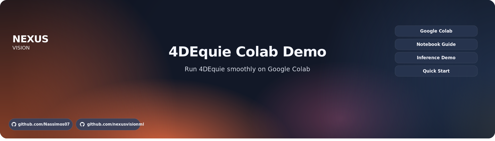

<div align="center">
  
</div>

<div align="center">

[](https://colab.research.google.com/drive/1yu7MEK9-bvO8iBZ1GZ9QbAJ_-V3_uHeA?usp=sharing)
[](https://colab.research.google.com/drive/1yu7MEK9-bvO8iBZ1GZ9QbAJ_-V3_uHeA?usp=sharing)
[](https://arxiv.org/abs/2603.10125)
[](https://arxiv.org/abs/2603.10125)
[](#-features)

</div>

<div align="center">
<strong>4DEquine Colab Demo</strong> — an end-to-end Google Colab notebook for running<br>
<a href="https://arxiv.org/abs/2603.10125">4DEquine: Disentangling Motion and Appearance for 4D Equine Reconstruction from Monocular Video</a> (CVPR 2026)
</div>

<br>

<div align="center">
This repo provides a fully documented, step-by-step Colab workflow for running 4DEquine inference.<br>
No local installation required — open the notebook, follow the sections, get 3D horse reconstructions.
</div>

---

## ✦ Overview

4DEquine reconstructs a **4D model** — 3D shape + articulated motion over time — of equine animals (horses, donkeys, zebras) from a single monocular video. The key idea is **disentangling** the 4D reconstruction problem into two sub-problems: recovering the dynamic motion sequence (AniMoFormer) and reconstructing the static appearance as a canonical 3D Gaussian avatar (EquineGS). The bridge connecting both is the [VAREN](https://varen.is.tue.mpg.de/) parametric horse model.

The output is a fully articulated, animatable 3D mesh (13,873 vertices, 27,706 faces) with per-frame pose, plus a 3D Gaussian Splatting avatar (55,486 Gaussian primitives) that can be rendered from arbitrary viewpoints.

This repository does not contain training code, model weights, or the 4DEquine source itself. It is a **demo and usage guide** that wraps the original [luoxue-star/4DEquine](https://github.com/luoxue-star/4DEquine) into a reproducible Colab notebook with all setup steps, dependency fixes, and troubleshooting documented.

---

## ✦ Pipeline

```
Horse video (MP4, monocular)
        │
        ▼
┌───────────────────────────────────────┐
│  Step 1 — SAM 3 (detection)           │
│  Step 2 — SAMURAI (tracking)          │
│  Step 3 — ViTPose++ (2D keypoints)    │
└───────────────┬───────────────────────┘
                ▼
┌───────────────────────────────────────┐
│  Step 4 — AniMoFormer                 │
│    ├─ Spatio-Temporal Transformer     │
│    └─ Post-Optimization (2 stages)    │
└───────────────┬───────────────────────┘
                ▼
┌───────────────────────────────────────┐
│  Step 5 — EquineGS (3DGS avatar)      │
└───────────────┬───────────────────────┘
                ▼
   Per-frame 3D meshes (.obj)
   Animated 3DGS avatar (rendered .mp4)
   VAREN pose/shape parameters (.pt)
```

---

## ✦ How 4DEquine Works

### ◐ The VAREN Model (the backbone of everything)

[**VAREN**](https://varen.is.tue.mpg.de/) (Very Accurate and Realistic Equine Network, CVPR 2024) is a data-driven 3D parametric model of the horse, learned from thousands of 3D scans of 50 real horses of varying breeds and sizes. Unlike previous animal models like SMAL, VAREN introduces **muscle deformation** — it groups body surface points into regions corresponding to the horse's superficial muscles and learns how articulation affects each muscle's observable deformation. The model takes shape parameters β ∈ ℝ³⁹, pose parameters θ ∈ ℝ³⁸ˣ³ (axis-angle rotations for 38 joints), and global translation γ ∈ ℝ³ to generate a high-resolution mesh with **V ∈ ℝ¹³⁸⁷³ˣ³** vertices and **F ∈ ℕ²⁷⁷⁰⁶ˣ³** faces through shape blend shapes, muscle deformation, and Linear Blend Skinning (LBS).

### ◐ Step 1 — Detect the horse with SAM 3

[**SAM 3**](https://huggingface.co/facebook/sam3) (Segment Anything Model 3, Meta) performs zero-shot detection and segmentation on the first frame, producing a pixel-accurate segmentation mask that serves as the seed for temporal tracking. SAM 3 is a **gated model** on HuggingFace — you must [request access](https://huggingface.co/facebook/sam3) and authenticate with a HuggingFace token.

### ◐ Step 2 — Track the horse across frames with SAMURAI

[**SAMURAI**](https://github.com/yangchris11/samurai) propagates the initial SAM 3 mask across all subsequent frames, outputting per-frame bounding boxes and segmentation masks. These masks serve as **pseudo ground-truth silhouettes** for the post-optimization stage. SAMURAI is included as a git submodule under `third-party/samurai`.

### ◐ Step 3 — Estimate 2D animal keypoints with ViTPose++

[**ViTPose++**](https://github.com/ViTAE-Transformer/ViTPose) (Huge variant, trained on [APT-36K](https://github.com/pandorgan/APT-36K)) predicts 2D anatomical keypoints for the horse in each frame. APT-36K is a large-scale animal pose dataset covering 30 species including horses, with keypoints for eyes, nose, shoulders, elbows, hooves, hips, knees, tail, etc. The SAMURAI bounding boxes are used to crop each frame before keypoint inference. These keypoints serve as **pseudo ground-truth 2D keypoints** for the post-optimization stage. ViTPose++ is included as a git submodule under `third-party/ViTPose`, and requires adding the submodule to `PYTHONPATH` to register its custom ViT backbone.

### ◐ Step 4 — Lift to 3D with AniMoFormer + Post-Optimization

**AniMoFormer** is a two-stage framework for temporal VAREN parameter recovery:

**Stage A — Spatio-Temporal Transformer**: Built upon AniMer, the network processes video clips in a sliding window of N=16 frames. Each frame is processed individually by a **Spatial Transformer** (ViT-Huge backbone) to extract spatial features. These features are stacked and fed into a **Temporal Transformer** that uses self-attention across the N-frame window to capture motion context. Finally, a **VAREN Transformer Decoder** regresses per-frame pose (θ), shape (β), and camera parameters. The temporal attention is what prevents the jittering inherent in single-image methods. For videos longer than 16 frames, a sliding-window strategy enables inference on arbitrary-length sequences.

**Stage B — Post-Optimization**: A two-stage refinement process using a differentiable renderer (PyTorch3D). The predicted mesh is projected to produce rendered silhouettes and 2D keypoints, which are compared against the pseudo ground-truth from ViTPose++ and SAMURAI:
- **Stage 1** (100 iterations): Optimizes all VAREN parameters + camera, prioritizing keypoint alignment (λ₂D=10000, λ_mask=100)
- **Stage 2** (100 iterations): Freezes pose and camera, refines shape only, prioritizing silhouette alignment (λ_mask=10000, λ₂D=100)

The combined loss includes: L₂D (keypoint reprojection), L_mask (silhouette overlap), L_smooth (temporal smoothness), and L_reg (pose regularization).

> ⚠️ **This is the most GPU-intensive step.** All frame parameters (pose, shape, camera for every frame), optimizer states (Adam stores 2× parameters), the VAREN model, silhouette targets, and the differentiable renderer are loaded onto GPU simultaneously.

### ◐ Step 5 — Build the 3DGS avatar with EquineGS

**EquineGS** reconstructs an animatable 3D Gaussian Splatting avatar from a **single representative frame**. The architecture:

1. **Canonical Point Cloud Initialization**: The VAREN template mesh (13,873 vertices) is subdivided by adding a vertex at each edge midpoint and splitting each face into four, yielding **N_G = 55,486 initial Gaussian positions**.

2. **Dual-Stream Feature Extraction**: A frozen [**DINOv3**](https://github.com/facebookresearch/dinov3) ViT-L/16 backbone extracts multi-scale image feature maps (F_I ∈ ℝ⁷⁸⁴ˣ¹⁰²⁴). In parallel, 3D point coordinates are processed through positional encoding + MLP to produce point features (F_P ∈ ℝᴺᴳˣ¹⁰²⁴).

3. **DSTG Decoder** (Dual-Stream Transformer Gaussian): A modified MMDiT block (from Qwen-Image) that fuses image features with point features via global context modulation and joint self-attention. The decoder outputs per-Gaussian attributes: positional offset Δμ, rotation r, scale s, color c, and opacity o.

4. **Animation via LBS**: The canonical Gaussians are deformed into per-frame pose space using VAREN's Linear Blend Skinning driven by the AniMoFormer parameters, then rendered using the 3DGS tile-based rasterizer.

### ◐ Training Data (for reference)

Both components are trained **exclusively on synthetic data**:
- **VarenPoser**: 1,171 synthetic video clips at 512×512, 60 FPS. Built by fitting VAREN to the marker-based PFERD horse motion dataset, with textures from MV-Adapter and three camera trajectories (fix, dolly, orbit). Contains VAREN parameters, 3D/2D keypoints, and segmentation masks per frame.
- **VarenTex**: 150K synthetic multi-view images at 512×512. Generated using UniTex conditioned on normal maps and canonical coordinate maps from VarenPoser meshes, with ControlNet-generated reference images for appearance guidance.

### ◐ Outputs

| Output | Format | Description |
|--------|--------|-------------|
| `refined_results.pt` | PyTorch dict | Per-frame VAREN parameters: `refined_global_orient` (N×6), `refined_pose` (N×222), `refined_betas` (N×39), `refined_cam` (N×3), `vertices` (N×13873×3), `keypoints_2d` (N×21×2), `silhouettes` (N×256×256) |
| `refined_mesh.mp4` | Video | VAREN mesh overlay on original video (pose verification) |
| `animer_outputs.pt` | PyTorch tensor | Stage A raw AniMoFormer predictions (before post-optimization) |
| `mask_list.pkl` | Pickle | Per-frame SAMURAI segmentation masks |
| `vitpose_results.pkl` | Pickle | Per-frame ViTPose++ 2D keypoint detections |
| `animate.mp4` | Video | 3DGS avatar animated with the extracted pose sequence |
| `cano.mp4` | Video | 3DGS avatar in canonical (rest) pose, rotating view |
| `frame_XXXX.obj` | OBJ mesh | Per-frame exportable 3D meshes (via custom export script in notebook) |
| `mesh_*.mp4` | Video | High-quality rendered mesh animations (via custom PyTorch3D renderer in notebook) |

---

## ✦ Results & Performance

From the paper (Table 1), AniMoFormer achieves state-of-the-art on all benchmarks:

| Method | APT-36K PCK@0.05↑ | APT-36K PCK@0.1↑ | AiM PCK@0.05↑ | AiM PCK@0.1↑ | VarenPoser CD↓ |
|--------|-------------------|-------------------|---------------|--------------|----------------|
| 3D-Fauna | 20.1 | 51.4 | 33.3 | 71.8 | 43.0 |
| 4D-Fauna | 25.5 | 53.5 | 46.5 | 74.8 | 38.5 |
| Dessie | 22.0 | 53.1 | 40.3 | 75.9 | 10.0 |
| AniMer | 44.5 | 76.6 | 55.5 | 87.7 | 15.2 |
| **AniMoFormer** | **61.8** | **83.9** | **84.2** | **95.3** | **3.4** |

4DEquine also generalizes zero-shot to unseen equine species (donkeys, zebras) despite being trained exclusively on horse data.

---

## ✦ Requirements

### ◐ Hardware

| Resource | Requirement |
|----------|------------|
| **GPU** | NVIDIA A100 80 GB VRAM **(required)** |
| **Runtime** | Google Colab (Pro/Pro+ for A100 80 GB access) |
| **Google Drive** | ~8 GB free space for checkpoints |

> ⚠️ The post-optimization loads all frame parameters, optimizer states (Adam 2×), and the differentiable renderer onto GPU simultaneously. Memory scales linearly with frame count. An A100 80 GB handles ~1000+ frames (~30+ seconds at 30fps). An A100 40 GB will OOM on videos longer than ~500 frames. Consumer GPUs are insufficient.

### ◐ External Models & Checkpoints

| Model | Source | Registration | Size | Purpose |
|-------|--------|-------------|------|---------|
| **4DEquine checkpoints** | [Google Drive](https://drive.google.com/drive/folders/1YDtNaKmueDoyP-NgySrp-BtJR0Pv9ftk) | None | ~5 GB | AniMoFormer + EquineGS + pretrain_temporal.pth + config.yaml |
| **VAREN** | [varen.is.tue.mpg.de](https://varen.is.tue.mpg.de/) | Required (Max Planck) | ~200 MB | `VAREN.pkl` (shape space, skinning weights, template mesh, muscle labels) + `varen.pth` (muscle deformation network) |
| **SAM 3** | [huggingface.co/facebook/sam3](https://huggingface.co/facebook/sam3) | Required (HuggingFace gated) | ~3.4 GB | Zero-shot detection/segmentation (auto-downloaded) |
| **ViTPose++ Huge APT-36K** | [HuggingFace](https://huggingface.co/JunkyByte/easy_ViTPose) | None | ~2.5 GB | Animal 2D keypoint estimation |
| **DINOv3 ViT-L/16** | [Meta DINOv3](https://github.com/facebookresearch/dinov3) | Required (Meta) | ~1.1 GB | Frozen backbone for EquineGS |
| **HuggingFace token** | [huggingface.co/settings/tokens](https://huggingface.co/settings/tokens) | Required | — | Authentication for SAM 3 |

### ◐ Software Dependencies

| Package | Version | Purpose |
|---------|---------|---------|
| PyTorch | 2.5.1 + CUDA 12.1 | Core framework |
| PyTorch3D | 0.7.9 (source) | Differentiable mesh rendering |
| diff-gaussian-rasterization | latest (source) | 3DGS tile-based rasterizer |
| simple-knn | latest (source) | KNN for Gaussians |
| mmcv | 1.3.9 | OpenMMLab CV foundation |
| mmpose | 0.29.0 | Animal pose estimation (legacy API) |
| mmdet | auto | Object detection |
| detectron2 | latest | Detection framework |
| transformers | latest | HuggingFace (SAM 3) |
| pytorch-lightning | latest | Checkpoint loading |
| smplx | 0.1.28 | Parametric model utilities |
| LPIPS | latest | Perceptual loss (VGG) |
| kornia | latest | Differentiable CV ops |
| imageio + ffmpeg | latest | Video I/O |
| open3d | latest | 3D processing |

---

## ✦ Google Colab Notebook

[](https://colab.research.google.com/drive/1yu7MEK9-bvO8iBZ1GZ9QbAJ_-V3_uHeA?usp=sharing)

17 sections covering setup through export — see [notebook details](#-usage).

---

## ✦ Usage

1. Open the [Colab notebook](https://colab.research.google.com/drive/1yu7MEK9-bvO8iBZ1GZ9QbAJ_-V3_uHeA?usp=sharing)
2. Set runtime to **A100 80 GB**
3. Run each cell in order
4. Upload your horse video when prompted (MP4, 5–20s, single horse, 720p)

> ⚠️ Ensure the horse is fully visible and not occluded in frame 1 — EquineGS uses it for appearance.

### ◐ Google Drive Structure

```
MyDrive/4DEquine/
├── AniMoFormer/checkpoints/checkpoint.ckpt
├── EquineGSFinetuneRealDataset/checkpoints/checkpoint.ckpt
├── pretrain_temporal.pth    (2.66 GB)
├── config.yaml
├── VAREN.pkl                (varen.is.tue.mpg.de)
├── varen.pth                (varen.is.tue.mpg.de)
└── dinov3_vitl16_pretrain_lvd1689m-8aa4cbdd.pth  (Meta)
```

---

## ✦ Troubleshooting

| Issue | Fix |
|-------|-----|
| samurai submodule fails | `sed -i 's\|git@github.com:\|https://github.com/\|g' .gitmodules && git submodule sync && git submodule update --init --recursive` |
| `No module named mmpose` | `pip install mmpose==0.29.0` |
| `ViT not in registry` | Add ViTPose to PYTHONPATH |
| `data/varen/` not found | Download from varen.is.tue.mpg.de |
| `data/apt36k.pth` missing | Download from HuggingFace JunkyByte/easy_ViTPose |
| SAM 3 `401` | Request access + HF login |
| DINOv3 not found | Download from Meta portal |
| CUDA OOM | Requires A100 80 GB; trim video if needed |
| PyTorch3D build hangs | Normal, 10–15 min |
| Mesh upside-down | Flip Y and Z: `vertices[:,:,1]*=-1; vertices[:,:,2]*=-1` |

---

## ✦ Limitations

From the paper:
- VAREN does not adequately represent **tail and mane** physics/appearance
- Cannot handle **dynamic lighting** variations
- EquineGS degrades with **severe occlusion/truncation** in the reference frame
- **Single horse only** per video
- No built-in 3D export — custom scripts provided in the notebook

---

## ✦ References

- **4DEquine**: Lyu, An, Cheng, Liu, Tang. CVPR 2026. [arXiv](https://arxiv.org/abs/2603.10125) | [Code](https://github.com/luoxue-star/4DEquine) | [Project](https://luoxue-star.github.io/4DEquine_Project_Page/)
- **VAREN**: Zuffi et al. CVPR 2024. [Project](https://varen.is.tue.mpg.de/)
- **AniMer**: Lyu et al. CVPR 2025.
- **SAM 3**: Meta. [HuggingFace](https://huggingface.co/facebook/sam3)
- **SAMURAI**: Yang et al. 2024. [GitHub](https://github.com/yangchris11/samurai)
- **ViTPose++**: Xu et al. TPAMI 2023. [GitHub](https://github.com/ViTAE-Transformer/ViTPose)
- **APT-36K**: Yang et al. NeurIPS 2022. [GitHub](https://github.com/pandorgan/APT-36K)
- **DINOv3**: Simeoni et al. 2025. [GitHub](https://github.com/facebookresearch/dinov3)
- **3DGS**: Kerbl et al. ACM TOG 2023.
- **PFERD**: Li et al. Scientific Data, 2024.

---

## ✦ Citation

```bibtex
@misc{lyu20264dequine,
    title={4DEquine: Disentangling Motion and Appearance for 4D Equine Reconstruction from Monocular Video},
    author={Jin Lyu and Liang An and Pujin Cheng and Yebin Liu and Xiaoying Tang},
    year={2026},
    eprint={2603.10125},
    archivePrefix={arXiv},
    primaryClass={cs.CV},
}
```

---

## ✦ Author

**Notebook by**: Nassim — Senior Computer Vision Engineer @ [Sparrow Computing](https://www.upwork.com/freelancers/nassim)

Built through hands-on experimentation — debugging every dependency conflict, missing checkpoint, hardcoded path, and OOM issue to produce a working end-to-end inference pipeline.

---

## ✦ License

This repository contains a demo notebook and documentation only. No model weights, datasets, or source code are redistributed. Users must comply with the licenses of individual models and tools referenced above.